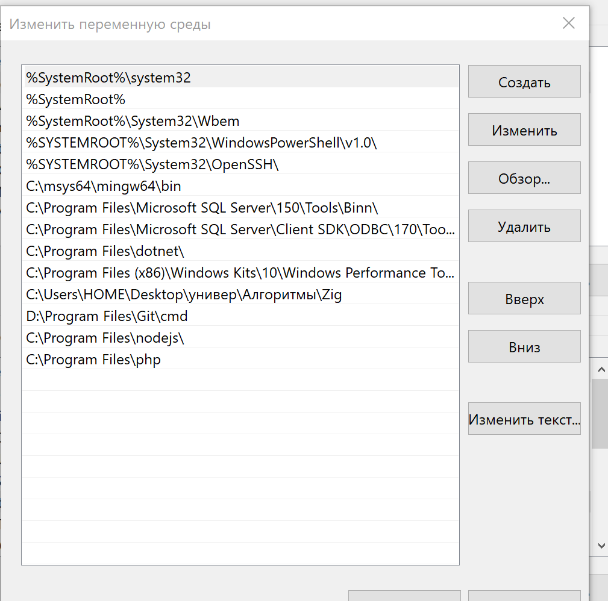
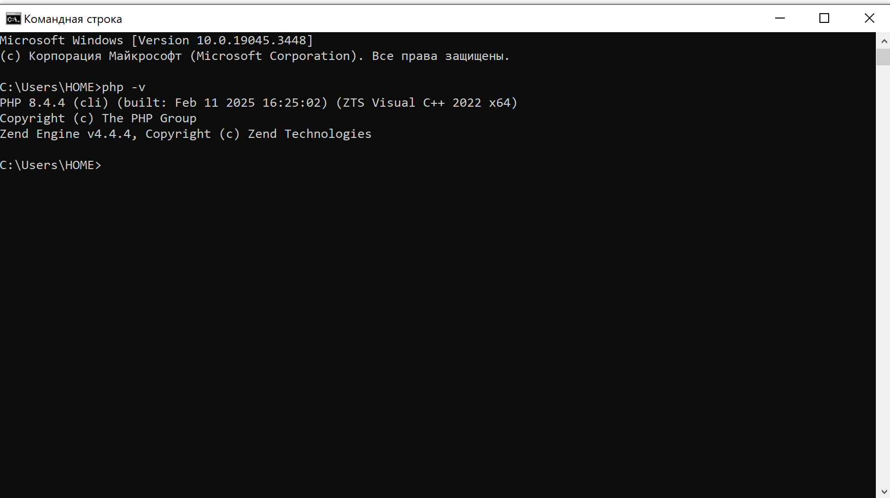

# Лабораторная работа №1. Установка и первая программа на PHP

## Студент
**Gachayev Dmitrii I2302**  
**Выполнено 19.02.2025**  

## Описание задачи
Целью данной лабораторной работы является установка и настройка среды разработки для работы с языком программирования PHP, а также создание первой программы на PHP.

## Шаг 1: Установка PHP

Для установки php я захожу на официальный сайт [https://www.php.net/downloads](https://www.php.net/downloads) и устанавливаю актуальную версию.

Далее добавляю папку с php в переменные среды Path.

 

Затем проверяю верную установку php прописывая php -v в cmd

 

php установлен.

## Шаг 2: Написание первой PHP-программы

