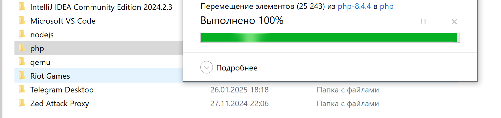
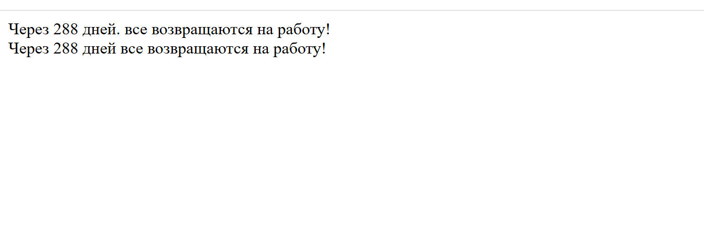

# Лабораторная работа №1. Установка и первая программа на PHP

## Студент
**Gachayev Dmitrii I2302**  
**Выполнено 19.02.2025**  

## Описание задачи
Целью данной лабораторной работы является установка и настройка среды разработки для работы с языком программирования PHP, а также создание первой программы на PHP.

## Шаг 1: Установка PHP

Для установки php я захожу на официальный сайт [https://www.php.net/downloads](https://www.php.net/downloads) и устанавливаю актуальную версию.

Далее добавляю папку с php в переменные среды Path.

 

Затем проверяю верную установку php прописывая php -v в cmd

 

php установлен.

## Шаг 2: Написание первой PHP-программы
Предварительно устанавливаю PHP Server для vscode создаю файл index.php, вставляю в него
```php
<?php
    echo "Привет, мир!";
?>
```

Запускаю сервер:

 

## Шаг 3: Вывод данных в PHP
Вывожу строку "Hello, World!" используя функцию echo и print.

```php
<?php
   echo "Hello, World with echo!<br>";
   print "Hello, World with print!";
?>
```
 

## Шаг 4: Работа с переменными и выводом
Создаю 2 переменные:
- Целочисленную переменную $days со значением 288.
- Строковую переменную $message с текстом: все возвращаются на работу!.
```php
$days = 288;
$message = "все возвращаются на работу!";
```

Далее вывожу переменные двумя разными способами:
```php
// конкатенация
echo "Через " . $days . " дней " . $message . "<br>";
//  через кавычки
echo "Через $days дней $message <br>";
```
Далее запускаем программу и получаем:

 

## Контрольные вопросы
### 1. Какие способы установки PHP существуют?
   php можно установить через официальный сайт с ручным добавлением или через XAMPP, выбрав компоненты:
- Apache
- PHP
- phpMyAdmin
В моем случае я выбрал ручную установку через официальный сайт.

### 2. Как проверить, что PHP установлен и работает?
Для того чтобы проверить верно ли установлен php, достаточно ввести в командную строку
```bash
php -v
```
Если система распознает команду, php установлен верно.

### 2. Чем отличается оператор echo от print?
echo и print в php выполняют схожую задачу — вывод текста, но есть несколько отличий:

echo быстрее, чем print, потому что print возвращает 1, а echo просто выводит текст.
echo может принимать несколько аргументов, а print только один
в отличие от echo, print можно использовать в выражениях, так как он возвращает 1

## Вывод
В ходе выполнения данной лабораторной работы я научился устанавливать php, вносить путь к нему в переменные среды, устанавливать и запускать PHP Server, а также проверять и решать проблемы с установкой php.

## Библиография
1. (https://www.php.net/)[Официальный сайт php]
2. (https://moodle.usm.md/mod/assign/view.php?id=300532)[Курс на Moodle - Advanced Web Development]

3. (Официальный сайт php)[https://www.php.net/]
4. (Курс на Moodle - Advanced Web Development)[https://moodle.usm.md/mod/assign/view.php?id=300532]
